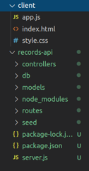

# Record Collection: Step Four

At this point, you've built an entire API for [your uncle's record collection app](README.md). You *are* a computer genius, just like your grandma told him! You should be feeling pretty good about yourself.

>

But your uncle doesn't know much about REST APIs, and he'd like to be able to use this app on his phone from the record store -- so it's time to connect your API to a front end using jQuery!

## Get set up

So far, we've been doing our work on the API in the `/records-api` directory. Let's separate our front-end work into a different space we'll call `/client`:

```bash
cd ..
mkdir client
cd client
touch index.html style.css app.js
```

> Your directory structure should now look kinda like this:
>
> 

... to be continued!

